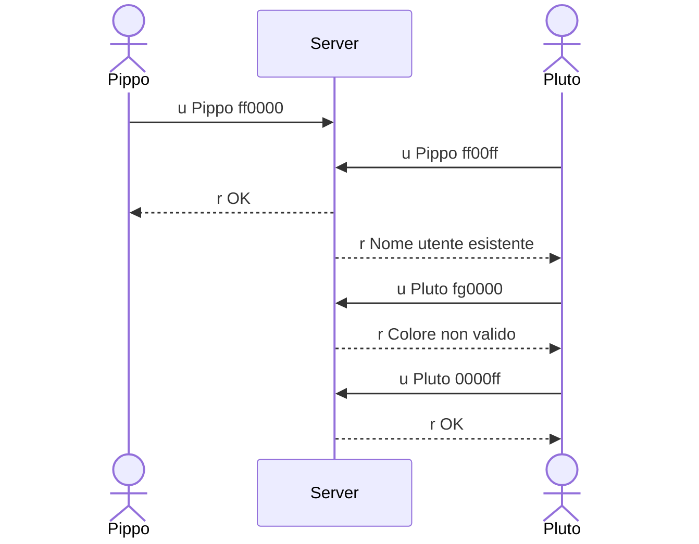
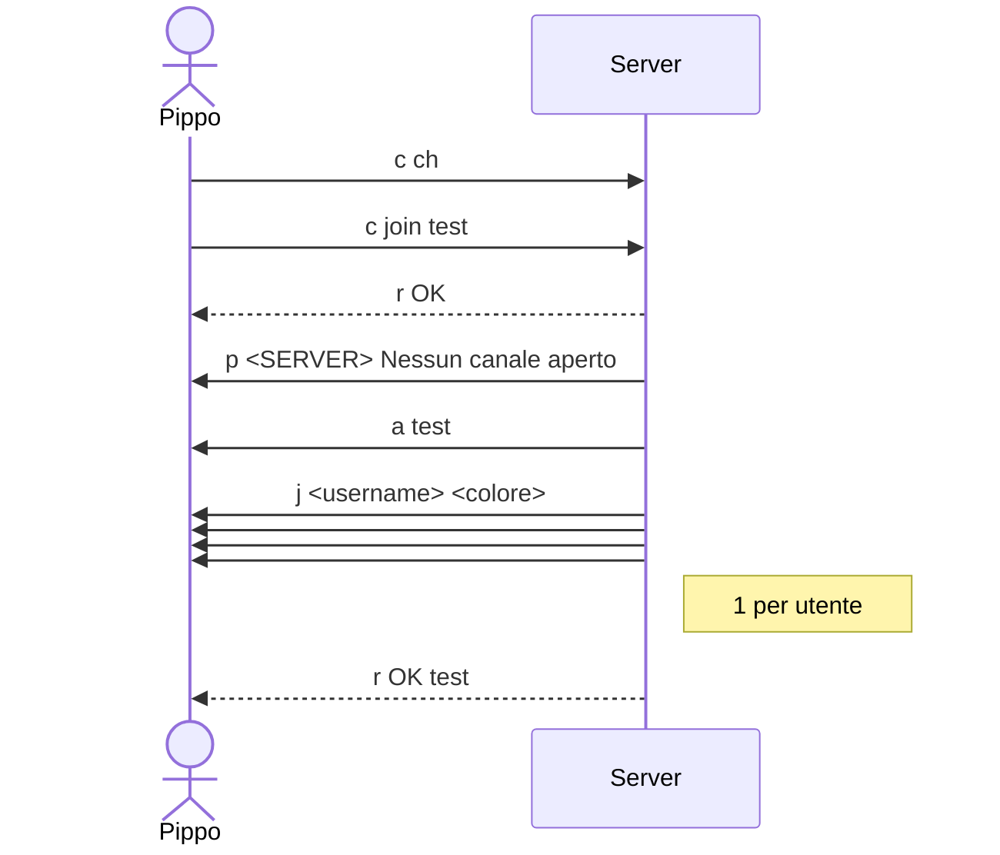
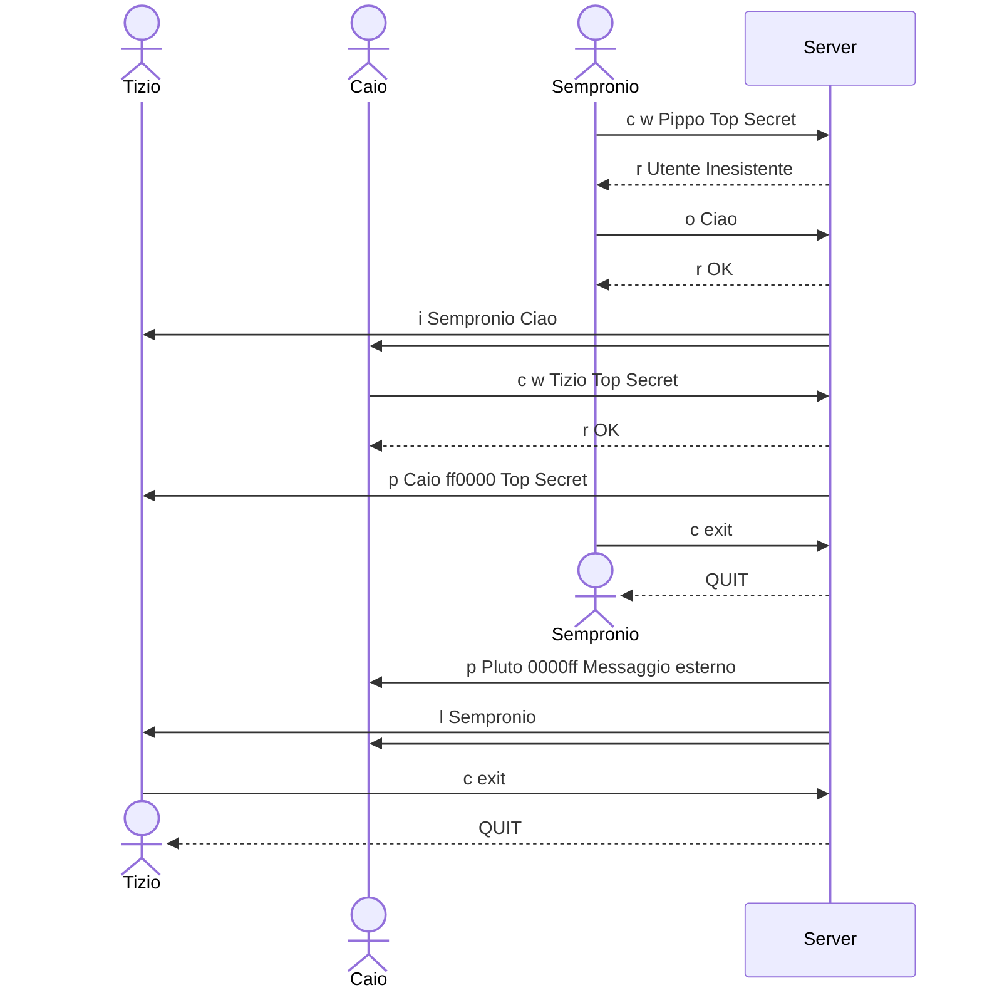

# JavaChat

Semplice chat Client Server in Java.

# Indice

- [JavaChat](#javachat)
- [Indice](#indice)
- [Connessione al server](#connessione-al-server)
- [Interfaccia grafica](#interfaccia-grafica)
- [Collegarsi a un canale](#collegarsi-a-un-canale)
- [Reference per i comandi](#reference-per-i-comandi)
	- [Comandi utente](#comandi-utente)
	- [Comandi canale](#comandi-canale)
	- [Comandi per amministratori](#comandi-per-amministratori)
- [Protocollo di connessione](#protocollo-di-connessione)
	- [Messaggi client](#messaggi-client)
	- [Messaggi server](#messaggi-server)
- [Diagramma di connessione](#diagramma-di-connessione)
	- [Connessione e login](#connessione-e-login)
	- [Comando](#comando)
	- [Canale](#canale)
	- [Disconnessione](#disconnessione)
- [Todo](#todo)

# Connessione al server

La comunicazione avviene su porta 16384, il progetto contiene due classi java eseguibili: `Client` grafico Java Swing e `Server`.

# Interfaccia grafica

Inizialmente viene richiesto un nome utente e un colore. Il nome utente deve essere unico nel server, senza spazi e non più lungo di 24 caratteri.

La schermata principale della chat contiene due pannelli, il pannello sinistro contiene un titolo che indica se è lista di canali o utenti. È lista di nomi di canali quando non si è connessi ad alcun canale altrimenti la lista di canali si tramuta in lista di utenti collegati al canale corrente.

Quando si clicca su un canale dal pannello sinistro il testo della barra di immissione diventa `/join <nomecanale>`, dove nomecanale assume, ovviamente, il nome del canale selezionato. Quando, analogamente si clicca su un utente dalla lista, il testo della barra di immissione diventa `/whisper <nomeutente>`, sostituendo a `<nomeutente>` il nome utente selezionato.

Il pannello destro contiene una finestra di chat, con una barra di immissione, un tasto invia e una lista di messaggi che viene cancellata ogni volta che si entra in un canale, si esce da un canale, o lo si cambia.

# Collegarsi a un canale

Per collegarsi a un canale bisogna immettere il comando `/join <nomecanale>`. Il server notificherà con un messaggio tutti gli utenti presenti prima dell'entrata nel canale con un messaggio contenente: "`nomeutente` è entrato nel canale". Qualora ci si colleghi ad un canale non esistente, questo viene creato e l'utente vi si collega. In ogni momento l'utente collegato da più tempo ad un canale è l'amministratore ed ha accesso a comandi aggiuntivi (vedi [Comandi per amministratori](#comandi-per-amministratori)).

Una volta che si è connessi ad un canale, si può scrivere messaggi che verranno inoltrati direttamente a tutti gli altri utenti del canale e si possono scrivere e ricevere [messaggi privati](#messaggi-privati). Si ha accesso anche ai comandi che trovi in [comandi canale](#comandi-canale).

È possibile abbandonare un canale immettendo il comando `/leave`, tutti gli utenti restanti nel canale vengono notificati tramite un messaggio contenente: "`nomeutente` ha lasciato il canale".

# Reference per i comandi

## Comandi utente

- `/join <nomecanale>`, permette di [collegarsi a un canale](#collegarsi-a-un-canale);
- `/j <nomecanale>` alias di `/join`;
- `/leave <nomecanale>`, permette di abbandonare un canale;
- `/l` alias di `/leave`;
- `/channels`, il server invia un messaggio privato che inizia per "Canali aperti: " e segue la lista di tutti i canali aperti. Qualora nessun canale fosse aperto, il messaggio privato contiene "Nessun canale è aperto";
- `/ch` alias di `/channel`;
- `/whisper <username> <messaggio>`, invia un messaggio privato all'utente `<username>` se esiste. Se il messaggio non viene recapitato, il server invia una risposta contenente il messaggio dell'errore, mentre se viene recapitato correttamente il server invia un messaggio privato all'utente che indica che il messaggio è stato recapitato con successo;
- `/w` alias di `/whisper`;
- `/exit` chiude la connessione.

## Comandi canale

- `/users`, il server risponderà con un messaggio privato che dice: "`N` utenti sono collegati:  `utente1`, `utente2`;
- `/mychannel`, il server invierà un messaggio privato che dice: "Sei collegato a `nomecanale`", oppure: "Non sei collegato ad un canale".

## Comandi per amministratori

- `/mute <username>`, il server silenzia l'utente dal canale, quell'utente non potrà scrivere messaggi nel canale dell'amministratore. Il server, inoltre, invia all'utente destinatario un messaggio che dice: "Sei stato silenziato";
- `/m <username>`, alias di `/mute;
- `/unmute <username>`, il server toglie lo stato di muto dall'utente, quell'utente potrà tornare a scrivere messaggi nel canale dell'amministratore. Il server, inoltre, invia all'utente destinatario un messaggio che dice: "Non sei più silenziato";
- `/mutelist <username>`, il server risponde con un messaggio privato all'amministratore contenente un elenco di tutti gli utenti silenziati nel canale corrente.

# Protocollo di connessione

Il protocollo scambia messaggi testuali codificati in utf-8. Ogni messaggio inizia con un carattere che ne indica la natura.

## Messaggi client

I messaggi che cominciano con le seguenti lettere vengono inviati esclusivamente dal client.

- `c` (da command), formattato `c <stringa comando>`, la stringa di comando può contenere spazi, il comando è analizzato dal sever tra quelli nella sezione [reference comandi](#reference-per-i-comandi);
- `o` (da outbound), formattato `o <messaggio>`, il messaggio può contenere spazi ma non linee a capo, rappresenta un messaggio pubblico indirizzato a tutti gli utenti del canale corrente;
- `u` (da user), formattato `u <username> <colore>`, rappresenta la registrazione di un utente di nome `<username>`, senza spazi e lungo non più di 24 caratteri, e colore `<colore>`, una stringa esadecimale di 6 caratteri che rappresenta il colore in formato RGB.

## Messaggi server

I messaggi che cominciano con le seguenti lettere vengono inviati esclusivamente dal server.

- `i` (da inbound), formattato `i <username> <messaggio>`, rappresenta un messaggio inviato dall'utente `<username>`;
- `p` (da private), formattato  `p <username> <colore> <messaggio>`, rappresenta un messaggio privato in arrivo dall'utente `<username>`, di colore `<colore>`;
- `a` (da add channel), formattato `a <nomecanale>`, rappresenta un nuovo canale attivo di nome `<nomecanale>`, da mostrare nella lista di canali del client;
- `d` (da delete channel), formattato `d <nomecanale>`, rappresenta un canale eliminato di nome `<nomecanale>`, da rimuovere dalla lista di canali del client;
- `j` (da join), formattato `j <username> <colore>`, rappresenta una notifica di connessione di un utente di nome `<username>` e colore `<colore>` (stringa esadecimale di 6 caratteri, che rappresenta un colore in RGB) connesso al canale corrente;
- `l` (da leave), formattato `l <username>`, rappresenta una notifica di disconnessione di un utente di nome `<username>` dal canale corrente;
- `r` (da response), formattato `r <messaggio>`, indica una risposta per un messaggio dal server a messaggi di tipo `c`, `o`, e `u`. Se la risposta è `OK`, la richiesta del client è andata a buon fine; se la risposta è `OK <testo>`, indica che il client si è collegato con successo al canale `<testo>`; se la risposta è `<testo>`, il messaggio è da interpretare come messaggio di errore. L'ordine di arrivo dei messaggi è garantito dal protocollo TCP, mentre il server dovrà garantire l'invio delle risposte nell'ordine di ricezione.

# Diagramma di connessione

## Connessione e login

La prima fase della connessione, il server si assicura che ogni utente abbia uno username univoco e che i colori siano stringhe esadecimali valide di 6 caratteri.

## Comando

In questa fase del collegamento, il client può solo inviare dei comandi o messaggi privati, in quanto non fa parte di un canale. Nel diagramma di sotto è riportata, oltre all'esecuzione di un comando `/ch`, la connessione al canale `test`.

## Canale

Esempio di conversazione tra 3 utenti collegati allo stesso canale. Durante la conversazione il server potrebbe inviare notifiche di altro genere, come `a` (add channel), messaggio privato da un utente non connesso al canale 

## Disconnessione

Qualora il flusso TCP dovesse terminare per qualunque ragione, l'utente relativo è da considerare disconnesso a tutti gli effetti, rimosso dal canale (se era connesso ad uno), dalla lista degli utenti e da ovunque vi siano riferimenti all'utente, in modo da permettere al garbage collector di de-allocare l'istanza dell'utente dal server.

# Todo

- [x] [Comandi utente](#comandi-utente)
    - [x] `/w`
    - [x] `/j`
    - [x] `/l`
    - [x] `/ch`
    - [x] `/exit`
- [x] [Comandi canale](#comandi-canale)
	- [x] `/mychannel`
- [x] [Comandi per amministratori](#comandi-per-amministratori)
	- [x] `/mute`
	- [x] `/m`
	- [x] `/unmute`
	- [x] `/mutelist`
- [x] [Protocollo di connessione](#protocollo-di-connessione)
    - [x] `a` (da add channel)
    - [x] `d` (da delete channel)
- [ ] misc
    - [x] Implementare un controllo se il colore inviato è un colore valido. Se un utente malevolo dovesse interferire con il protocollo, il server crasherebbe provocando DoS.
    - [x] Come implementiamo un messaggio privato da un utente che non è connesso al canale attuale? Da dove prendiamo il suo colore?
    - [x] Mute overhaul
    - [ ] Implementare il pannello laterale lato client
