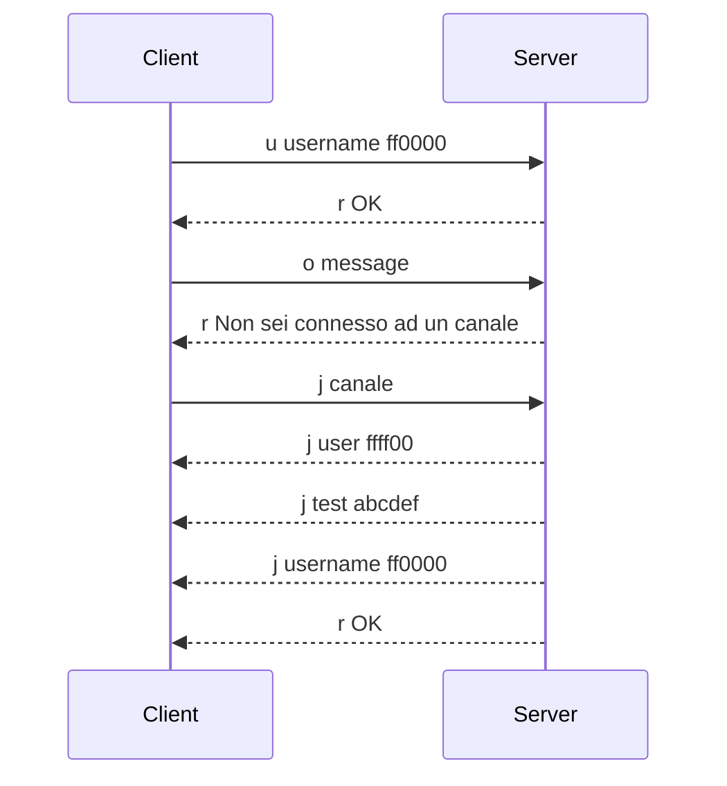

# JavaChat

Chat con interfaccia grafica in Java 

## Protocollo di connessione

Il protocollo scambia messaggi testuali codificati in utf-8. Ogni messaggio inizia con un carattere che ne indica la natura.

I caratteri iniziali codificati nel protocollo sono:

- `m` (da message), vedi la sezione [messaggi pubblici](#messaggi-pubblici).
- `p` (da private), vedi la sezione [messaggi privati](#messaggi-privati).

La sintassi dei messaggi del protocollo è espressa segue:

- il testo fuori dalle parentesi è sintassi fissa;
- il testo in parentesi quadre `[]` è opzionale;
- il testo in parentesi angolari `<>` è obbligatorio.

### Messaggi Pubblici

Un pacchetto messaggio comincia per `m`. la sua sintassi è `m <nome utente> <corpo del messaggio>`, dove:

- `<nome utente>` è un nome utente che deve essere valido, in caso non lo sia il messaggio è scartato;
- `<messaggio>` è il corpo del messaggio.

Così che:

`m <nome utente> <messaggio>` inviato dal server al client, rappresenta un messaggio in arrivo nel canale attuale da parte di `<nome utente>`;

`m <messaggio>` inviato dal client al server 

### Messaggi privati

Un pacchetto messaggio privato comincia per `p`. La sua sintassi è `p <target> <corpo del messaggio>`, dove:

- `<target>` è il nome utente del destinarario o del mittente, in caso non sia valido il messaggio è scartato;
- `<corpo del messaggio>` è il corpo del messaggio;

Così che:

`p <target> <messaggio>` inviato dal client al server, rappresenta un messaggio privato inviato dall'utente attuale a `<target>`;

`p <target> <messaggio>` inviato dal server al client, rappresenta un messaggio privato inviato da `<target>` all'utente attuale.

### Stato

Un pacchetto di stato comincia per `s`.

### Query

Un pacchetto di query comincia per `q`.

## Diagramma di Connessione

Il protocollo si articola con messaggi testuali codificati in standard utf-8.

Ogni messaggio è strutturato come segue: `<carattere iniziale> <corpo del messaggio>`

Il carattere iniziale è codificato e può assumere solo i seguenti valori:

<!-- FIX: È inutile che il messaggio dell'utente contenga lo username -->
<!-- FIX: È impossibile modificare l'username -->

- `c` (da command) - Il client invia al server `c <stringa comando>` e il server risponderà secondo le specifiche alla sezione [comandi](#comandi);
- `m` (da message) - Se il client invia al server `m <username> <messaggio>`, il messaggio verrà inviato a chiunque è connesso allo stesso canale dell'utente. Se il server invia un pacchetto formato analogamente, allora il client dovrà interpretarlo come messaggio in arrivo;
- `p` (da private) - Se il server invia al client `p <source> <messaggio>`, il client tratterà il messaggio come un messaggio privato da un singolo utente;
- `s` (da suggestion) - Il comando suggestion è formattato come segue `s <categoria> <n>`. Se è inviato dal client, rappresenta una richiesta di n elementi da parte del server, se ritornato dal server invia, segue una lista di dati strutturati come da sezione [categorie](#categorie);
- `j` (da join) - Il server invia `j <username> <colore>` ad ogni client collegato ad un canale dove si è aggiunto un nuovo membro, dove username è il nome utente e color è un codice di 6 cifre esadecimali che rappresenta il colore associato all'utente;
- `l` (da leave) - Il server invia `l <username>` ad ogni client collegato ad un canale dove un membro ha appena abbandonato;
- `u` (da update) - Il server invia `u <username> <colore>` ad ogni client collegato ad un canale dove un utente ha deciso di modificare il suo colore associato;
- `d` (da data) - Il server invia `d <n> ` seguito da $n$ coppie di `<username> <colore>` intervallate da spazi singoli, a indicare gli utenti presenti in un canale;
- `e` (da error) - Il server invia `e <stringa di errore>` in caso di un qualunque errore.

## Comandi

I comandi sono interpretati in maniera case insensitive e cominciano tutti con il carattere `/`. Il server riceverà solo ed esclusivamente la stringa di comando, ovvero la parte successiva al carattere `/`.

Sono comandi validi:
- `/join <nome canale>`, serve a entrare in un canale o a cambiare il canale attuale. L'utente può chattare su un canale per volta. `<nome canale>` deve essere una stringa senza spazi, altrimenti il server restituisce un errore.
- `/channels`, mostra la lista dei canali aperti;
- `/mychannel`, ritorna il nome del canale attuale;
- `/users`, ritorna la lista di utenti collegati al canale attuale;
- `/whisper <nome utente> <messaggio>`, invia un messaggio privato all'utente specificato.

L'utente più anziano di un canale è sempre l'amministratore. L'amministratore ha accesso ai seguenti comandi:
- `/ban <nome utente>`, l’utente specificato sarà bannato: continua a restare nel cannale, ma non potrà scrivere nulla. Se un client bannato prova a scrivere qualcosa, il server lo informa che è bannato. L’amministratore non deve potersi bananare da solo;
- `/unban <nome utente>`, l’utente specificato potrà riprendere a inviare messaggi dentro la chat;
- `/banlist`, visualizza la lista degli utenti bannati.

## Categorie

Sono categorie valide:
- `c` (da channel), il server ritorna $n$ stringhe separate da spazi che rappresentano i nomi dei canali attivi;
- `u` (da users), il server ritorna una lista di $n$ utenti indicati da una coppia `<nome utente> <colore>`;
- `m` (da command), il server ritorna una lista di $n$ comandi accettabili strutturati come `<nome> <descrizione>`, separati da doppio spazio. La descrizione comincia con i parametri del comando.
